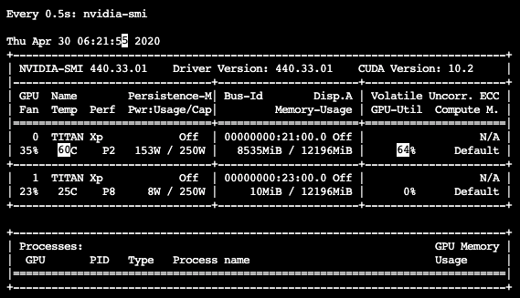

# Real-Time Checking NVIDIA-SMI

## 1. Introduction

딥러닝 신경망을 학습하다보면 GPU 상태를 확인해볼 필요가 있다. 그 명령어가 `nvidia-smi` 인데 이거를 매번 타이핑하는 것은 굉장히 비효율적인 행동이다. 리눅스 명령어를 통하여 실시간 모니터링이 가능하도록 하자.

> cuda 관련 환경 구축이 전부 되어있음을 가정한다.

## 2. Monitoring

아래의 명령어를 터미널에서 타이핑한다.

- `watch -d -n 0.5 nvidia-smi`

그러면 아래와 같이 화면이 나온다.

위의 명령어는 nvidia-smi 를 0.5초에 한 번씩 새로고침되도록 하는 명령어이다. 이를 통하여 실시간 모니터링이 가능하다.