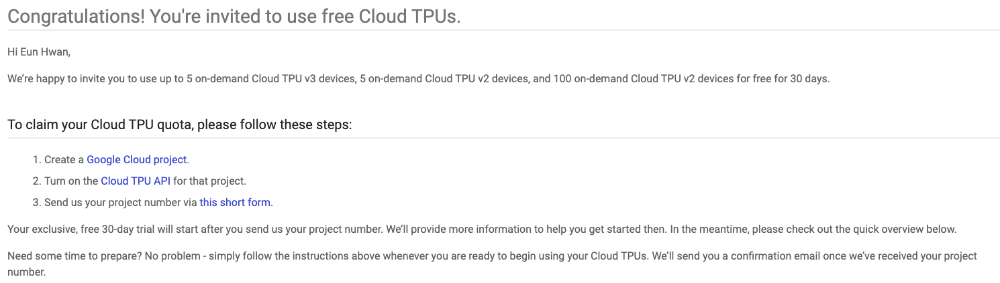

# 여름 방학동안 뭐하지 ?

이번 글만큼은 약간 러프한 나의 생각을 나열해보자! 러프한 생각 나열이니 글씨 말투도 러프하게 하자!

- 회사 인턴
- AI Rush
- 인라이플 KorQuAD Challenge 마무리
- EmotionGIF 2020
- 밑바닥부터 시작하는 딥러닝 1~2 복습
- 기초 수학 복습
- 운동 (aka. 건강한 삶)

연구와 관련된 모든 것을 지탱할 수 있는 나의 비장의 무기.

하하하하!!! 꺄르륵!!! 내가 지금까지 이걸 아껴두고 있었지!!!

열심히 해야징 쿄쿄쿄...